# Task Flows - Phases, Tasks, and Agent Coordination

> Written by Architect Agent (Opus) | 2026-05-10
> This document defines the phased delivery plan, per-script task flows, agent assignments, and peer review workflows.

---

## 1. Phase Breakdown

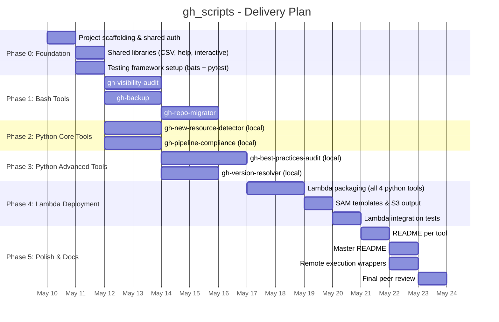

### Phase Summary

| Phase | Name | Duration | Dependencies | Deliverables |
|-------|------|----------|--------------|-------------|
| 0 | Foundation | 2 days | None | Scaffolding, shared auth, test frameworks |
| 1 | Bash Tools | 4 days | Phase 0 | Scripts 1, 2, 3 with tests |
| 2 | Python Core | 2 days | Phase 0 | Scripts 4, 5 (local mode) with tests |
| 3 | Python Advanced | 3 days | Phase 2 | Scripts 6, 7 (local mode) with tests |
| 4 | Lambda | 3 days | Phase 3 | Lambda packaging, SAM, S3 integration |
| 5 | Polish | 3 days | Phase 4 | Docs, remote execution, final review |

---

## 2. Per-Script Task Flows

### 2.1 gh-visibility-audit (Bash)

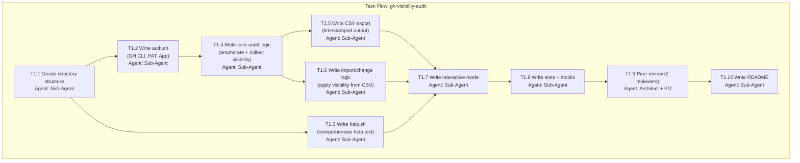

**Tool Definition:**

| Attribute | Value |
|-----------|-------|
| Name | `gh-visibility-audit` |
| Language | Bash |
| Directory | `tools/gh-visibility-audit/` |
| Auth Methods | GH CLI (default), PAT (`--token`), GitHub App (`--app-id` + `--app-key`) |
| Input Formats | CLI flags, CSV import (`--import`) |
| Output Format | CSV: `timestamp,enterprise,org,user,repo,visibility` |
| Lambda | No -- bash only, local execution |
| Test Framework | bats-core |

**Key Functions:**

| Function | File | Purpose |
|----------|------|---------|
| `get_auth_token` | lib/auth.sh | Resolve auth method and return token |
| `list_repos` | gh-visibility-audit.sh | Enumerate repos at given scope |
| `get_visibility` | gh-visibility-audit.sh | Get visibility for a single repo |
| `set_visibility` | gh-visibility-audit.sh | Change visibility for a single repo |
| `export_csv` | lib/csv.sh | Write results to timestamped CSV |
| `import_csv` | lib/csv.sh | Read CSV and apply changes |
| `show_help` | lib/help.sh | Print comprehensive help with examples |
| `run_interactive` | lib/interactive.sh | Guided question mode |

---

### 2.2 gh-backup (Bash)

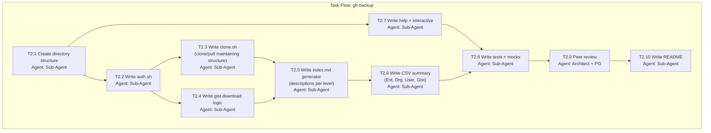

**Tool Definition:**

| Attribute | Value |
|-----------|-------|
| Name | `gh-backup` |
| Language | Bash |
| Directory | `tools/gh-backup/` |
| Auth Methods | GH CLI (default), PAT, GitHub App |
| Input Formats | CLI flags (`--enterprise`, `--org`, `--user`), `--include-gists` |
| Output Format | Directory tree maintaining GitHub structure; CSV index; `index.md` per level |
| Lambda | No |
| Test Framework | bats-core |

**Key Functions:**

| Function | File | Purpose |
|----------|------|---------|
| `get_auth_token` | lib/auth.sh | Auth resolution |
| `enumerate_targets` | gh-backup.sh | Walk enterprise > org > user > repo |
| `clone_repo` | lib/clone.sh | Clone or pull a single repo |
| `download_gists` | lib/clone.sh | Fetch all gists for a user |
| `generate_index` | lib/index.sh | Create index.md with descriptions |
| `export_summary_csv` | gh-backup.sh | Write backup summary CSV |
| `show_help` | lib/help.sh | Help text |
| `run_interactive` | lib/interactive.sh | Interactive mode |

**Directory structure maintained during backup:**

```
backup_root/
|-- enterprise-name/
|   |-- org-name/
|   |   |-- user-name/
|   |   |   |-- repo-name/          # Full clone
|   |   |   |-- gists/
|   |   |   |   |-- gist-id/        # Each gist
|   |   |   |-- index.md
|   |   |-- index.md
|   |-- index.md
|-- YYYYMMDD_HHMMSS_Github_backup.csv
```

---

### 2.3 gh-repo-migrator (Bash)

```mermaid
flowchart TD
    subgraph "Task Flow: gh-repo-migrator"
        T1["T3.1 Create directory structure<br/>Agent: Sub-Agent"]
        T2["T3.2 Write auth.sh<br/>Agent: Sub-Agent"]
        T3["T3.3 Write transfer logic<br/>(single repo transfer)<br/>Agent: Sub-Agent"]
        T4["T3.4 Write bulk import<br/>(CSV: repo, new_owner)<br/>Agent: Sub-Agent"]
        T5["T3.5 Write validation<br/>(check permissions, verify orgs)<br/>Agent: Sub-Agent"]
        T6["T3.6 Write result CSV<br/>(repo, old, new, status)<br/>Agent: Sub-Agent"]
        T7["T3.7 Write help + interactive<br/>Agent: Sub-Agent"]
        T8["T3.8 Write tests + mocks<br/>Agent: Sub-Agent"]
        T9["T3.9 Peer review<br/>Agent: Architect + PO"]
        T10["T3.10 Write README<br/>Agent: Sub-Agent"]

        T1 --> T2
        T2 --> T5
        T5 --> T3
        T3 --> T4
        T4 --> T6
        T6 --> T7
        T7 --> T8
        T8 --> T9
        T9 --> T10
    end
```

**Tool Definition:**

| Attribute | Value |
|-----------|-------|
| Name | `gh-repo-migrator` |
| Language | Bash |
| Directory | `tools/gh-repo-migrator/` |
| Auth Methods | GH CLI, PAT, GitHub App (needs admin on both source and target orgs) |
| Input Formats | `--repo OWNER/REPO --new-owner ORG` (single), `--import CSV` (bulk) |
| Output Format | CSV: `timestamp,repo,old_owner,new_owner,status,error_message` |
| Lambda | No |
| Test Framework | bats-core |

**Key Functions:**

| Function | File | Purpose |
|----------|------|---------|
| `get_auth_token` | lib/auth.sh | Auth resolution |
| `validate_permissions` | lib/transfer.sh | Check admin access on source and target |
| `transfer_repo` | lib/transfer.sh | Execute single repo transfer via API |
| `verify_transfer` | lib/transfer.sh | Confirm repo exists at new location |
| `process_csv` | lib/transfer.sh | Bulk process CSV of transfers |
| `export_results` | gh-repo-migrator.sh | Write results CSV |
| `show_help` | lib/help.sh | Help text |
| `run_interactive` | lib/interactive.sh | Interactive mode |

---

### 2.4 gh-new-resource-detector (Python)

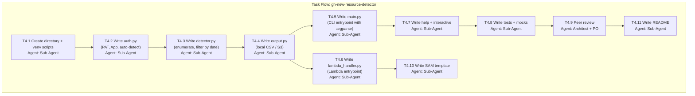

**Tool Definition:**

| Attribute | Value |
|-----------|-------|
| Name | `gh-new-resource-detector` |
| Language | Python 3.9+ |
| Directory | `tools/gh-new-resource-detector/` |
| Auth Methods | PAT (`--token` / `GITHUB_TOKEN`), GitHub App (`--app-id` + `--app-key`) |
| Input Formats | CLI flags; `--since` for time window; `--type repos\|orgs\|all` |
| Output Format | CSV: `timestamp,enterprise,org,resource_type,resource_name,created_at,created_by` |
| Lambda | Yes -- EventBridge trigger, S3 output |
| Local | Yes -- venv, local CSV output |
| Test Framework | pytest + responses + moto |

**Key Functions:**

| Function | File | Purpose |
|----------|------|---------|
| `get_token(auth_config)` | lib/auth.py | Resolve auth, return token |
| `generate_jwt(app_id, key)` | lib/auth.py | Generate JWT for GitHub App |
| `get_installation_token(jwt, install_id)` | lib/auth.py | Exchange JWT for installation token |
| `list_orgs(token, enterprise)` | lib/detector.py | Enumerate all orgs in enterprise |
| `list_new_repos(token, org, since)` | lib/detector.py | Find repos created after `since` |
| `list_new_orgs(token, enterprise, since)` | lib/detector.py | Find orgs created after `since` |
| `write_local_csv(results, output_dir)` | lib/output.py | Write timestamped CSV locally |
| `write_s3(results, bucket, prefix)` | lib/output.py | Write CSV to S3 |
| `lambda_handler(event, context)` | lambda_handler.py | Lambda entrypoint |
| `main()` | main.py | CLI entrypoint |
| `ask_questions()` | lib/interactive.py | Interactive guided mode |

**Lambda Configuration:**

```yaml
Runtime: python3.12
Timeout: 300
MemorySize: 256
Environment:
  GITHUB_APP_ID: (from Secrets Manager)
  GITHUB_APP_KEY: (from Secrets Manager)
  OUTPUT_BUCKET: gh-scripts-output
Events:
  Schedule:
    Type: Schedule
    Properties:
      Schedule: rate(1 day)
```

---

### 2.5 gh-pipeline-compliance (Python)

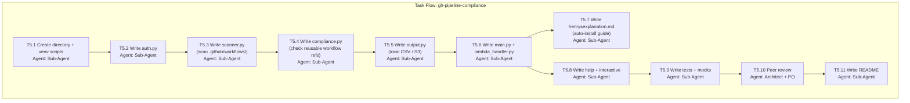

**Tool Definition:**

| Attribute | Value |
|-----------|-------|
| Name | `gh-pipeline-compliance` |
| Language | Python 3.9+ |
| Directory | `tools/gh-pipeline-compliance/` |
| Auth Methods | PAT, GitHub App |
| Input Formats | `--org`, `--reusable-workflow owner/repo/path`, `--pipeline-pattern REGEX` |
| Output Format | CSV: `timestamp,org,repo,workflow_file,uses_reusable,reusable_ref,compliant,details` |
| Lambda | Yes |
| Local | Yes |
| Test Framework | pytest + responses + moto |

**Key Functions:**

| Function | File | Purpose |
|----------|------|---------|
| `get_token(auth_config)` | lib/auth.py | Auth resolution |
| `list_repos(token, org)` | lib/scanner.py | Enumerate repos in org |
| `get_workflow_files(token, owner, repo)` | lib/scanner.py | Fetch .github/workflows/*.yml |
| `parse_workflow(yaml_content)` | lib/scanner.py | Parse workflow YAML |
| `check_reusable_usage(workflow, expected_ref)` | lib/compliance.py | Check if workflow uses reusable pipeline |
| `find_patterns(workflow, patterns)` | lib/compliance.py | Search for custom patterns in workflows |
| `score_compliance(results)` | lib/compliance.py | Calculate compliance percentage |
| `write_local_csv(results, dir)` | lib/output.py | Local CSV output |
| `write_s3(results, bucket)` | lib/output.py | S3 output |

**Auto-Install Documentation** (for `henrysexplanation.md`):

The script will document how to:
1. Create a GitHub App with `contents:read` on all org repos
2. Set org policy to require the app
3. Configure EventBridge to run the Lambda daily
4. Set up SNS notifications for non-compliant repos

---

### 2.6 gh-best-practices-audit (Python)

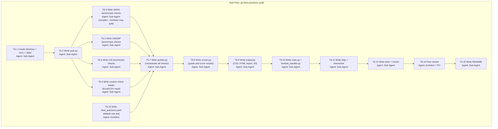

**Tool Definition:**

| Attribute | Value |
|-----------|-------|
| Name | `gh-best-practices-audit` |
| Language | Python 3.9+ |
| Directory | `tools/gh-best-practices-audit/` |
| Auth Methods | PAT, GitHub App (enterprise admin for full audit) |
| Input Formats | `--enterprise`, `--org`, `--frameworks SANS,OWASP,CIS`, `--custom-checks file.xlsx`, `--local-files PATH` |
| Output Format | CSV (detailed results), HTML (visual report), S3 (Lambda) |
| Lambda | Yes |
| Local | Yes |
| Test Framework | pytest + responses + moto |

**Key Functions:**

| Function | File | Purpose |
|----------|------|---------|
| `get_token(auth_config)` | lib/auth.py | Auth resolution |
| `check_branch_protection(token, owner, repo)` | lib/benchmarks/sans.py | SANS: branch protection rules |
| `check_signed_commits(token, owner, repo)` | lib/benchmarks/sans.py | SANS: commit signing enforcement |
| `check_secret_scanning(token, owner, repo)` | lib/benchmarks/owasp.py | OWASP: secret scanning enabled |
| `check_dependency_review(token, owner, repo)` | lib/benchmarks/owasp.py | OWASP: Dependabot alerts |
| `check_code_scanning(token, owner, repo)` | lib/benchmarks/owasp.py | OWASP: CodeQL or equivalent |
| `check_org_2fa(token, org)` | lib/benchmarks/cis.py | CIS: 2FA enforcement |
| `check_sso_enabled(token, org)` | lib/benchmarks/cis.py | CIS: SSO/SAML configured |
| `check_gitignore_quality(token, owner, repo)` | lib/benchmarks/cis.py | CIS: .gitignore present and adequate |
| `check_webhook_security(token, owner, repo)` | lib/benchmarks/cis.py | CIS: Webhook SSL, secrets |
| `load_custom_checks(filepath)` | lib/benchmarks/custom.py | Parse Excel/CSV custom checks |
| `run_check(check_def, token, target)` | lib/benchmarks/custom.py | Execute a custom check |
| `run_audit(config)` | lib/auditor.py | Orchestrate all checks across targets |
| `score_results(results, framework)` | lib/scorer.py | Calculate scores per framework |
| `grade_overall(scores)` | lib/scorer.py | A-F grading |
| `write_csv(results, dir)` | lib/output.py | CSV output |
| `write_html_report(results, dir)` | lib/output.py | HTML report |
| `write_s3(results, bucket)` | lib/output.py | S3 output |

**Benchmark Checks Summary:**

| Framework | Category | Checks |
|-----------|----------|--------|
| SANS | Access Control | Branch protection, signed commits, CODEOWNERS, required reviews |
| SANS | Secrets | No hardcoded secrets, secret scanning enabled, rotation policy |
| OWASP | Dependencies | Dependabot enabled, dependency review, license compliance |
| OWASP | Code Quality | Code scanning (CodeQL), SAST configured, vulnerability alerts |
| OWASP | Supply Chain | Pinned actions, signed releases, SBOM generation |
| CIS | Identity | 2FA enforced, SSO/SAML, IP restrictions, audit log |
| CIS | Configuration | .gitignore quality, webhook SSL, default branch rules |
| CIS | Monitoring | Audit log streaming, alert policies, security advisories |
| Custom | User-defined | Loaded from Excel/CSV, arbitrary API checks |

---

### 2.7 gh-version-resolver (Python)

```mermaid
flowchart TD
    subgraph "Task Flow: gh-version-resolver"
        T1["T7.1 Create directory + venv<br/>Agent: Sub-Agent"]
        T2["T7.2 Write auth.py<br/>Agent: Sub-Agent"]
        T3["T7.3 Write resolver.py<br/>(hash-to-release, release-to-hash)<br/>Agent: Sub-Agent"]
        T4["T7.4 Write currency.py<br/>(current / M-1 / N-1 / older)<br/>Agent: Sub-Agent"]
        T5["T7.5 Write output.py<br/>(CSV / S3)<br/>Agent: Sub-Agent"]
        T6["T7.6 Write main.py + lambda_handler.py<br/>Agent: Sub-Agent"]
        T7["T7.7 Write help + interactive<br/>Agent: Sub-Agent"]
        T8["T7.8 Write tests + mocks<br/>Agent: Sub-Agent"]
        T9["T7.9 Peer review<br/>Agent: Architect + PO"]
        T10["T7.10 Write README<br/>Agent: Sub-Agent"]

        T1 --> T2
        T2 --> T3
        T3 --> T4
        T4 --> T5
        T5 --> T6
        T6 --> T7
        T7 --> T8
        T8 --> T9
        T9 --> T10
    end
```

**Tool Definition:**

| Attribute | Value |
|-----------|-------|
| Name | `gh-version-resolver` |
| Language | Python 3.9+ |
| Directory | `tools/gh-version-resolver/` |
| Auth Methods | PAT, GitHub App |
| Input Formats | `--hash SHA`, `--release TAG`, `--action owner/action`, `--module provider/module`, `--import CSV` |
| Output Format | CSV: `timestamp,source,action_or_module,input_type,input_value,resolved_value,version_currency` |
| Lambda | Yes -- triggered by pipeline or scheduled |
| Local | Yes -- personal and business use |
| Test Framework | pytest + responses + moto |

**Key Functions:**

| Function | File | Purpose |
|----------|------|---------|
| `get_token(auth_config)` | lib/auth.py | Auth resolution |
| `hash_to_release(token, owner, repo, commit_sha)` | lib/resolver.py | Find release/tag containing commit |
| `release_to_hash(token, owner, repo, tag)` | lib/resolver.py | Get commit SHA for a release tag |
| `resolve_action_ref(token, action_ref)` | lib/resolver.py | Parse `owner/action@ref` and resolve |
| `resolve_terraform_module(token, module_ref)` | lib/resolver.py | Resolve Terraform module version |
| `get_all_releases(token, owner, repo)` | lib/resolver.py | Fetch all releases (paginated) |
| `check_currency(current_version, all_versions)` | lib/currency.py | Determine: current / M-1 / N-1 / older |
| `parse_semver(version_string)` | lib/currency.py | Parse semantic version |
| `write_local_csv(results, dir)` | lib/output.py | Local CSV |
| `write_s3(results, bucket)` | lib/output.py | S3 output |

**Version Currency Logic:**

```
current  = latest release
M-1      = one minor version behind (e.g., on 3.1.x when 3.2.x exists)
N-1      = one major version behind (e.g., on 2.x when 3.x exists)
older    = more than one major version behind
```

**Secrets Field Format (for CI/CD integration):**

```
Forward (release -> hash):
  Input:  actions/checkout@v4.1.0
  Output: actions/checkout@b4ffde65f46336ab88eb53be808477a3936bae11

Reverse (hash -> release):
  Input:  actions/checkout@b4ffde65f46336ab88eb53be808477a3936bae11
  Output: actions/checkout@v4.1.0 (currency: current)
```

---

## 3. Agent Assignment Summary

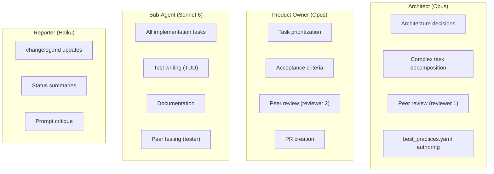

### Task-to-Agent Matrix

| Task ID | Task | Agent | Depends On |
|---------|------|-------|------------|
| P0.1 | Project scaffolding | Sub-Agent | -- |
| P0.2 | Shared auth (bash) | Sub-Agent | P0.1 |
| P0.3 | Shared auth (python) | Sub-Agent | P0.1 |
| P0.4 | Test framework setup | Sub-Agent | P0.1 |
| T1.1-T1.8 | gh-visibility-audit impl | Sub-Agent | P0.2, P0.4 |
| T1.9 | gh-visibility-audit review | Architect + PO | T1.8 |
| T1.10 | gh-visibility-audit docs | Sub-Agent | T1.9 |
| T2.1-T2.8 | gh-backup impl | Sub-Agent | P0.2, P0.4 |
| T2.9 | gh-backup review | Architect + PO | T2.8 |
| T2.10 | gh-backup docs | Sub-Agent | T2.9 |
| T3.1-T3.8 | gh-repo-migrator impl | Sub-Agent | P0.2, T1.8 |
| T3.9 | gh-repo-migrator review | Architect + PO | T3.8 |
| T3.10 | gh-repo-migrator docs | Sub-Agent | T3.9 |
| T4.1-T4.8 | gh-new-resource-detector impl | Sub-Agent | P0.3, P0.4 |
| T4.9 | gh-new-resource-detector review | Architect + PO | T4.8 |
| T4.10-T4.11 | gh-new-resource-detector Lambda + docs | Sub-Agent | T4.9 |
| T5.1-T5.9 | gh-pipeline-compliance impl | Sub-Agent | P0.3, P0.4 |
| T5.10 | gh-pipeline-compliance review | Architect + PO | T5.9 |
| T5.11 | gh-pipeline-compliance docs | Sub-Agent | T5.10 |
| T6.1-T6.12 | gh-best-practices-audit impl | Sub-Agent | P0.3, T4.8 |
| T6.13 | best_practices.yaml | Architect | -- |
| T6.14 | gh-best-practices-audit review | Architect + PO | T6.12, T6.13 |
| T6.15 | gh-best-practices-audit docs | Sub-Agent | T6.14 |
| T7.1-T7.8 | gh-version-resolver impl | Sub-Agent | P0.3, P0.4 |
| T7.9 | gh-version-resolver review | Architect + PO | T7.8 |
| T7.10 | gh-version-resolver docs | Sub-Agent | T7.9 |
| P5.1 | Per-tool READMEs | Sub-Agent | All T*.10/11 |
| P5.2 | Master README | Sub-Agent | P5.1 |
| P5.3 | Remote execution wrappers | Sub-Agent | P5.1 |
| P5.4 | Final peer review | Architect + PO | P5.3 |

---

## 4. Dependency Graph

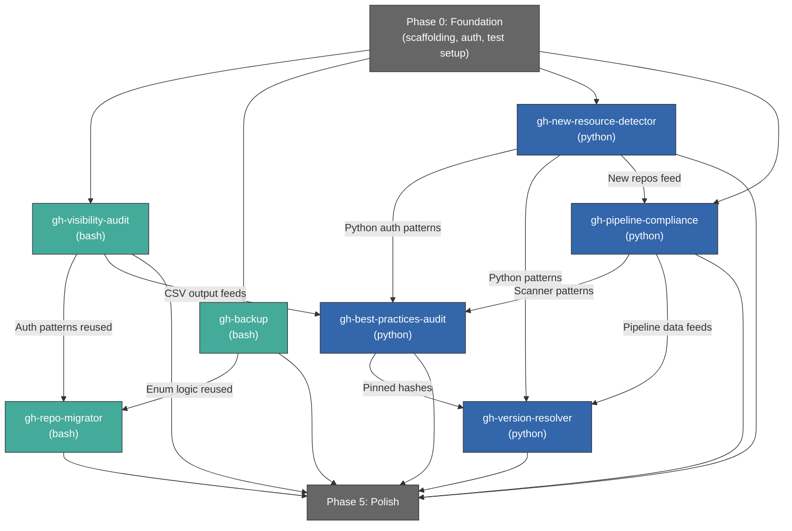

### Parallelization Opportunities

The following can be built in parallel (no hard dependencies):

**Parallel Group 1** (after Phase 0):
- `gh-visibility-audit` (bash)
- `gh-backup` (bash)
- `gh-new-resource-detector` (python)
- `gh-pipeline-compliance` (python)

**Parallel Group 2** (after Group 1):
- `gh-repo-migrator` (bash) -- reuses auth patterns from S1/S2
- `gh-best-practices-audit` (python) -- reuses patterns from S4/S5
- `gh-version-resolver` (python) -- reuses patterns from S4/S5

---

## 5. Peer Review Workflow

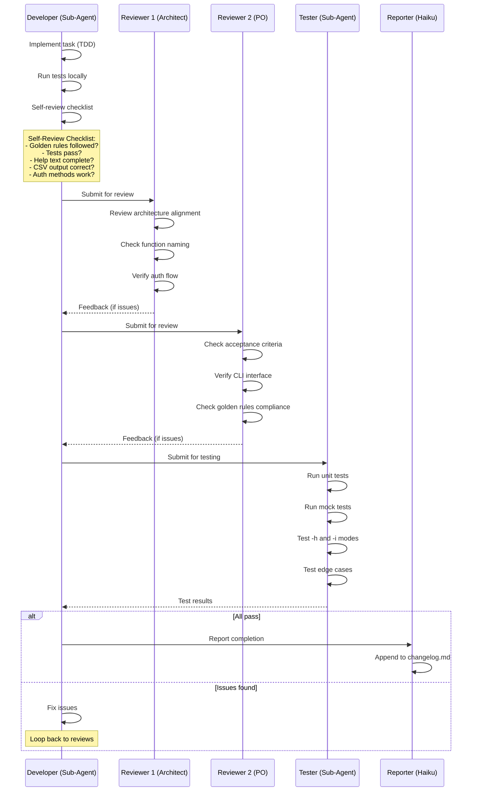

### Review Checklist Per Tool

| Check | Reviewer | Pass Criteria |
|-------|----------|---------------|
| Directory structure matches spec | Architect | All files in correct locations |
| Auth supports all 3 methods | Architect | GH CLI, PAT, App all work |
| `-h` / `--help` is comprehensive | PO | Shows usage, examples, all flags |
| `-i` / `--interactive` works | PO | Guided questions lead to correct execution |
| CSV output is timestamped | PO | Format: `YYYYMMDD_HHMMSS_<name>.csv` |
| Standard `-` / `--` notation | PO | All flags follow convention |
| "Written by h3nryza" stamp | PO | Present in script header |
| Tests exist and pass | Tester | 80%+ coverage on core logic |
| Mock tests cover API responses | Tester | Mocks for all API calls |
| Remote execution works | Tester | curl + bash pipeline succeeds |
| Python venv setup/teardown works | Tester | `setup_venv.sh` and `teardown_venv.sh` function |

---

## 6. Context Gathering and Sharing Flow

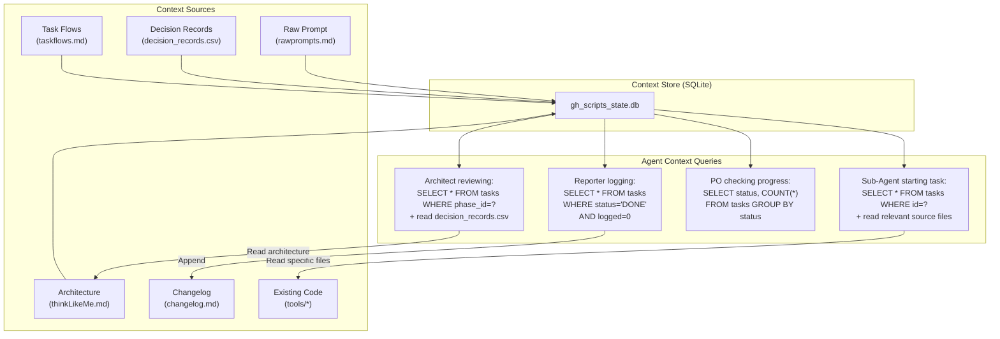

### Context Minimization Strategy

To reduce token consumption:

1. **SQLite store** tracks phase/task/subtask status -- agents query only what they need
2. **File references, not contents**: Task records contain file paths, not file contents
3. **Incremental context**: Each agent reads only the files relevant to its current task
4. **Append-only changelog**: Reporter appends summaries, never re-reads the full log
5. **Decision records are CSV**: Compact, queryable, not verbose markdown

### Context Per Agent Type

| Agent | Reads | Writes | Token Budget |
|-------|-------|--------|-------------|
| Architect | rawprompts.md, decision_records.csv, thinkLikeMe.md | thinkLikeMe.md, decision_records.csv, task definitions | High (needs full picture) |
| Product Owner | taskflows.md, task status from DB | Task assignments, acceptance criteria, PRs | Medium |
| Sub-Agent | Single task record + referenced files only | Code files, test files, README | Low (scoped to one task) |
| Reporter | Completed task records from DB | changelog.md (append only) | Minimal |

---

## 7. Test Strategy Per Tool

### Bash Tools (bats-core)

```bash
# Example test structure for gh-visibility-audit
@test "show help when -h flag is passed" {
    run ./gh-visibility-audit.sh -h
    [ "$status" -eq 0 ]
    [[ "$output" == *"Usage:"* ]]
    [[ "$output" == *"--enterprise"* ]]
}

@test "exit with error when no auth available" {
    # Mock gh auth status to fail
    function gh() { return 1; }
    export -f gh
    unset GITHUB_TOKEN

    run ./gh-visibility-audit.sh --org test-org
    [ "$status" -eq 1 ]
    [[ "$output" == *"No authentication method found"* ]]
}

@test "export CSV with correct headers" {
    # Mock gh api to return test data
    function gh() {
        echo '[{"name":"repo1","visibility":"public"},{"name":"repo2","visibility":"private"}]'
    }
    export -f gh

    run ./gh-visibility-audit.sh --org test-org --export /tmp/test.csv
    [ "$status" -eq 0 ]
    head -1 /tmp/test.csv | grep -q "timestamp,enterprise,org,user,repo,visibility"
}
```

### Python Tools (pytest)

```python
# Example test structure for gh-new-resource-detector
import pytest
from unittest.mock import patch
from lib.detector import list_new_repos

@pytest.fixture
def mock_repos():
    return [
        {"name": "repo1", "created_at": "2026-05-09T10:00:00Z"},
        {"name": "repo2", "created_at": "2026-05-10T10:00:00Z"},
        {"name": "repo3", "created_at": "2026-05-08T10:00:00Z"},
    ]

@patch("lib.detector.requests.get")
def test_list_new_repos_filters_by_date(mock_get, mock_repos):
    mock_get.return_value.json.return_value = mock_repos
    mock_get.return_value.status_code = 200

    results = list_new_repos(token="fake", org="test-org", since="2026-05-09")

    assert len(results) == 2
    assert results[0]["name"] == "repo1"
    assert results[1]["name"] == "repo2"

def test_list_new_repos_handles_empty_org():
    with patch("lib.detector.requests.get") as mock_get:
        mock_get.return_value.json.return_value = []
        mock_get.return_value.status_code = 200

        results = list_new_repos(token="fake", org="empty-org", since="2026-05-01")
        assert results == []
```

### Lambda Tests (moto)

```python
# Example Lambda test using moto
import boto3
from moto import mock_s3
from lambda_handler import lambda_handler

@mock_s3
def test_lambda_writes_to_s3():
    # Setup mock S3
    s3 = boto3.client("s3", region_name="us-east-1")
    s3.create_bucket(Bucket="gh-scripts-output")

    event = {
        "enterprise": "test-ent",
        "since": "2026-05-09",
        "output_bucket": "gh-scripts-output"
    }

    result = lambda_handler(event, None)

    assert result["statusCode"] == 200
    assert "s3://" in result["body"]["output_location"]
```

---

## 8. Golden Rules Compliance Checklist

This checklist is applied to every tool during peer review:

| # | Golden Rule | How It Is Enforced |
|---|-------------|-------------------|
| 1 | Maintain GitHub structure when downloading | gh-backup creates enterprise/org/user/repo tree |
| 2 | Comprehensive `-h`/`--help` with examples; `-i`/`--interactive` | Every tool has lib/help.sh or lib/help.py + lib/interactive.{sh,py} |
| 3 | Default output: timestamped CSV in query directory | `write_csv()` and `export_csv()` functions in every tool |
| 4 | Standard `-`/`--` CLI notation | argparse (Python) or getopts/case (Bash) with standard flags |
| 5 | Stamped "written by h3nryza" | Script header comment in every file |
| 6 | Appropriate language per tool | Bash for GH CLI wrappers, Python for Lambda/complex logic |
| 7 | Python tools get venv setup/teardown | `setup_venv.sh` and `teardown_venv.sh` in every Python tool |
| 8 | Remote execution via curl or GH without cloning | curl-pipe-bash for Bash; run_remote.sh wrapper for Python |
| 9 | Meaningful names, self-contained directories | kebab-case tool names; all files inside tool directory |
| 10 | Simple function names | `get_token`, `list_repos`, `check_compliance` -- no jargon |
| 11 | DDD and TDD | Domain-driven module structure; tests written before code |
| 12 | Mock and unit tests | bats-core (Bash) with function mocks; pytest (Python) with responses/moto |

---

*This document is maintained by the Architect Agent. Updates are logged in changelog.md.*
*Written by h3nryza*
