# Think Like Me - Architecture & Reasoning

> Written by Architect Agent (Opus) | 2026-05-10
> This document captures the full thinking, reasoning, and architectural decisions behind the gh_scripts suite.

---

## 1. Overall System Architecture

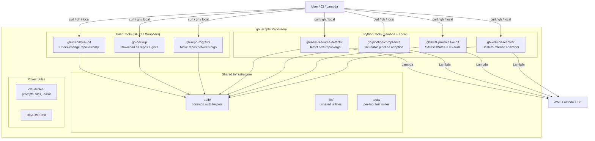

### Reasoning

The architecture follows the user's explicit request: **7 independent tools, not a monolith**. Each tool is self-contained in its own directory. A user can curl a single script and run it without cloning the repo. The shared `auth/` helpers are minimal -- each tool bundles what it needs.

Why not a single CLI with subcommands? Because:
1. User explicitly said "break these up independently"
2. Different languages (bash vs python) make a unified CLI awkward
3. Remote execution via curl requires standalone scripts
4. Lambda deployment needs self-contained packages

---

## 2. How the 7 Tools Relate

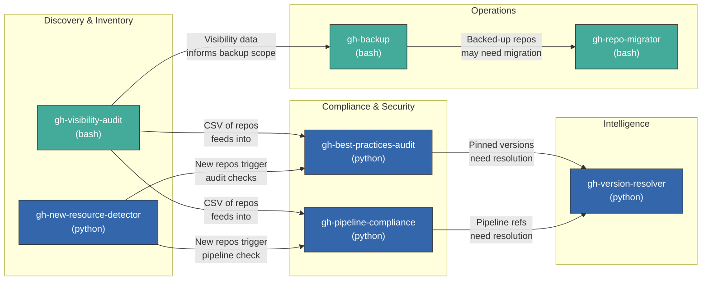

### Data Flow Summary

| From | To | Data | Purpose |
|------|----|------|---------|
| gh-visibility-audit | gh-best-practices-audit | CSV of repos + visibility | Audit only repos with risky visibility |
| gh-visibility-audit | gh-pipeline-compliance | CSV of repos | Check pipeline adoption across estate |
| gh-new-resource-detector | gh-best-practices-audit | New repo list | Auto-audit newly created repos |
| gh-new-resource-detector | gh-pipeline-compliance | New repo list | Check if new repos use reusable pipelines |
| gh-visibility-audit | gh-backup | Repo inventory | Scope what to back up |
| gh-backup | gh-repo-migrator | Backed-up repos | Migrate after backup |
| gh-best-practices-audit | gh-version-resolver | Pinned action hashes | Resolve hashes to versions |
| gh-pipeline-compliance | gh-version-resolver | Pipeline action refs | Resolve versions |

The tools are **loosely coupled** -- they share CSV as an interchange format but have no hard dependencies on each other. Any tool can run standalone.

---

## 3. Authentication Flow

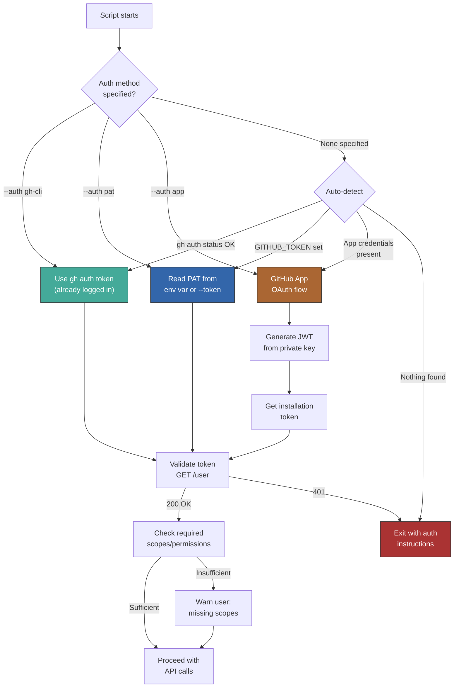

### Auth Method Details

**GH CLI (default for bash tools)**
- Simplest path: user already authenticated via `gh auth login`
- Token obtained via `gh auth token`
- Scopes inherited from `gh auth login` session
- Best for: local interactive use, personal repos

**PAT (Personal Access Token)**
- Environment variable `GITHUB_TOKEN` or `--token` flag
- Classic PAT or fine-grained PAT
- Best for: CI/CD, curl-based remote execution, automation

**GitHub App (OAuth App)**
- Requires: App ID, private key, installation ID
- Script generates JWT, exchanges for installation token
- Installation token scoped to specific orgs/repos
- Best for: enterprise, multi-org, least-privilege
- This is the recommended path for scripts 4-7 (Lambda)

### GitHub App Drill-Down Pattern

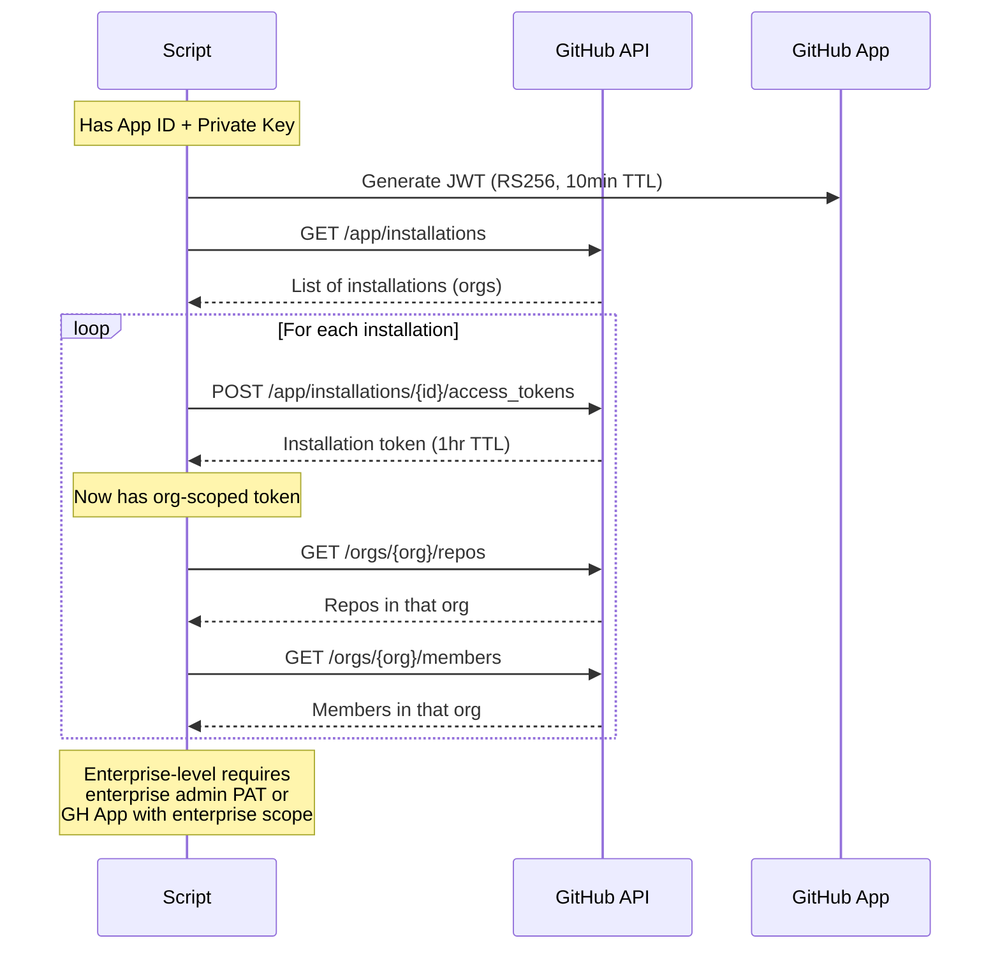

### Mandatory App Installation Issue

The user noted that mandatory installation of their GitHub App is not happening. Key documentation points:

1. **Organization-level installation** can be required by org owners via Settings > Third-party access > Policy
2. **Enterprise-level policy** can mandate app installation across all orgs
3. **The gap**: You cannot force a GitHub App to be installed -- you can only set org policy to require it
4. Recommendation: Use enterprise-level "pre-install" via `PUT /orgs/{org}/installations` with enterprise admin token

---

## 4. Data Flow Per Script

### Script 1: gh-visibility-audit

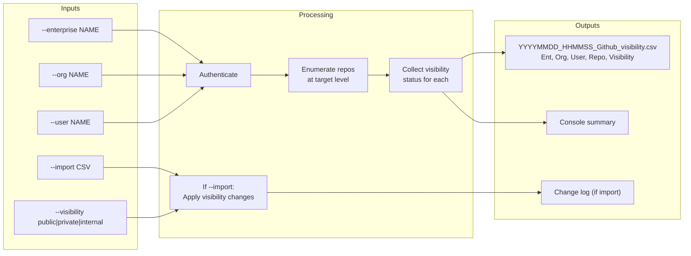

### Script 2: gh-backup

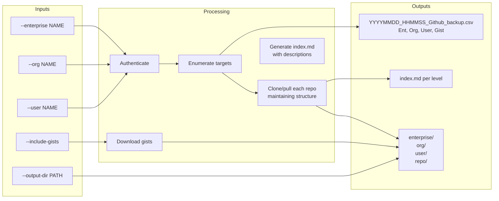

### Script 3: gh-repo-migrator

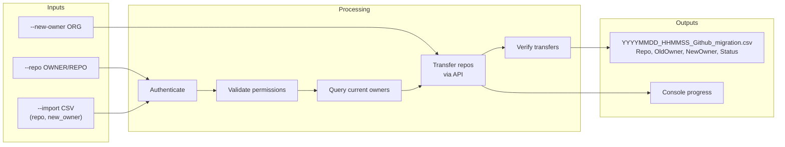

### Script 4: gh-new-resource-detector

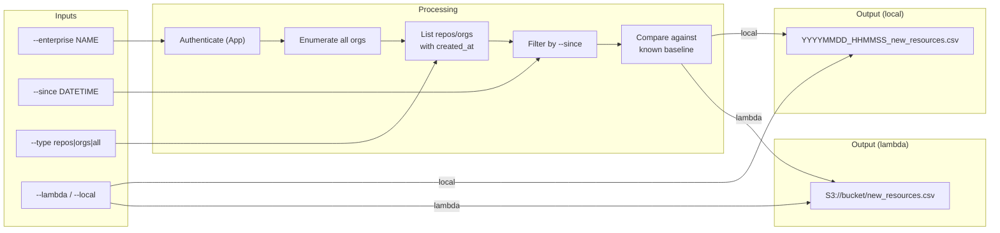

### Script 5: gh-pipeline-compliance

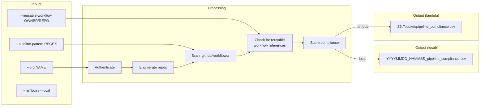

### Script 6: gh-best-practices-audit

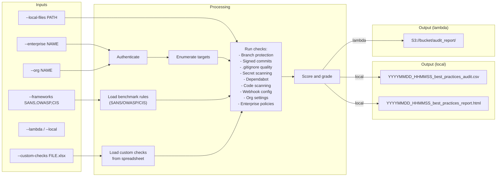

### Script 7: gh-version-resolver

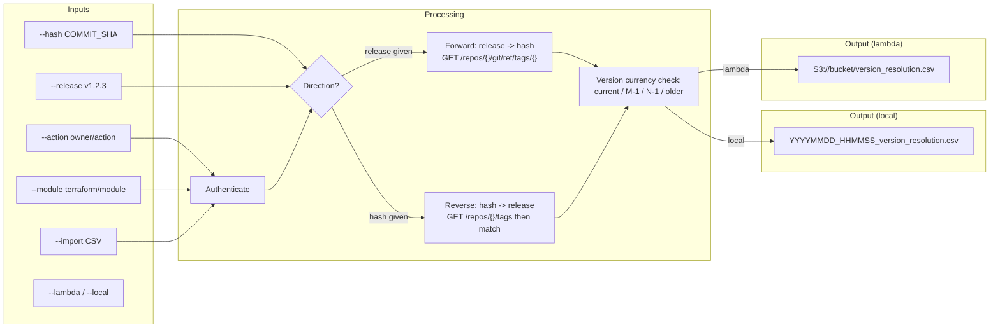

---

## 5. Agent Workflow

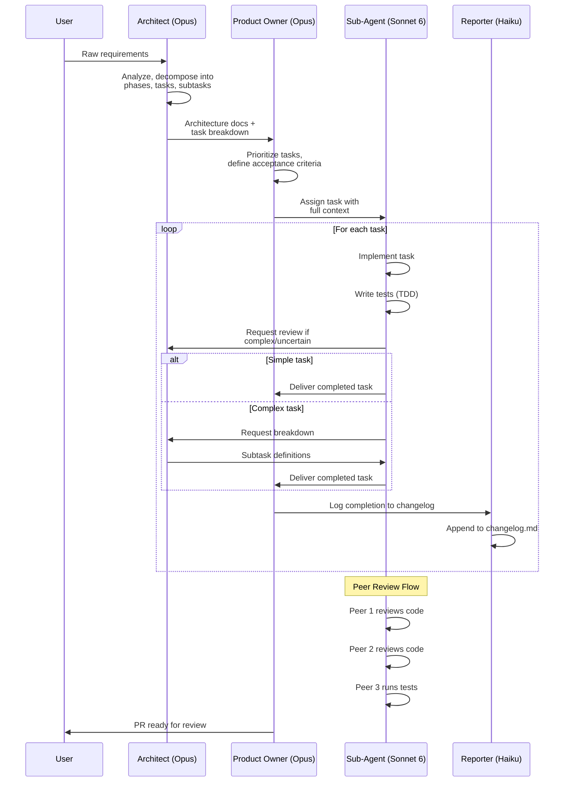

### Agent Responsibilities

| Agent | Model | Role | Produces |
|-------|-------|------|----------|
| Architect | Opus | System design, task decomposition, complex decisions | Architecture docs, task breakdowns, decision records |
| Product Owner | Opus | Prioritization, acceptance criteria, coordination | Task assignments, PRs, sprint plans |
| Sub-Agent | Sonnet 6 | Implementation, testing, code review | Code, tests, documentation |
| Reporter | Haiku | Logging, changelog, status updates | changelog.md entries, status summaries |

### Context Sharing Strategy

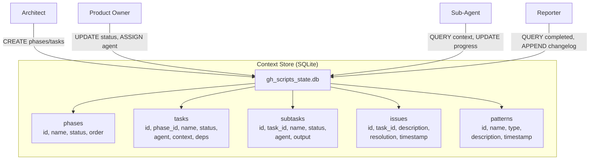

Each agent queries the SQLite store for context before starting work. This minimizes tokens -- an agent only pulls the rows it needs rather than reading the entire project state.

---

## 6. Directory Structure

```
gh_scripts/
|-- README.md                           # Project overview, per-tool summary, how-to-run
|-- claudefiles/
|   |-- prompts/
|   |   |-- rawprompts.md               # Raw user prompts (append-only)
|   |-- files/
|   |   |-- thinkLikeMe.md             # This file
|   |   |-- taskflows.md               # Task flow diagrams
|   |   |-- changelog.md               # Append-only changelog
|   |   |-- decision_records.csv       # Architecture decisions
|   |-- learnt/
|       |-- skills.md                   # New skills discovered
|       |-- agents.md                   # Agent configurations
|       |-- patterns.md                 # Valid patterns
|       |-- anti-patterns.md           # Anti-patterns found
|
|-- tools/
|   |-- gh-visibility-audit/
|   |   |-- gh-visibility-audit.sh      # Main script
|   |   |-- lib/
|   |   |   |-- auth.sh                # Auth helpers
|   |   |   |-- csv.sh                 # CSV helpers
|   |   |   |-- help.sh                # Help/usage text
|   |   |   |-- interactive.sh         # Interactive mode
|   |   |-- tests/
|   |   |   |-- test_visibility.sh     # Unit tests
|   |   |   |-- mocks/                 # Mock API responses
|   |   |-- README.md
|   |
|   |-- gh-backup/
|   |   |-- gh-backup.sh
|   |   |-- lib/
|   |   |   |-- auth.sh
|   |   |   |-- clone.sh              # Clone/pull logic
|   |   |   |-- index.sh              # index.md generator
|   |   |   |-- help.sh
|   |   |   |-- interactive.sh
|   |   |-- tests/
|   |   |   |-- test_backup.sh
|   |   |   |-- mocks/
|   |   |-- README.md
|   |
|   |-- gh-repo-migrator/
|   |   |-- gh-repo-migrator.sh
|   |   |-- lib/
|   |   |   |-- auth.sh
|   |   |   |-- transfer.sh           # Transfer logic
|   |   |   |-- help.sh
|   |   |   |-- interactive.sh
|   |   |-- tests/
|   |   |   |-- test_migrator.sh
|   |   |   |-- mocks/
|   |   |-- README.md
|   |
|   |-- gh-new-resource-detector/
|   |   |-- main.py                    # CLI entrypoint
|   |   |-- lambda_handler.py          # Lambda entrypoint
|   |   |-- lib/
|   |   |   |-- auth.py               # Auth helpers
|   |   |   |-- detector.py           # Core detection logic
|   |   |   |-- output.py             # CSV/S3 output
|   |   |   |-- help.py               # Help text
|   |   |   |-- interactive.py        # Interactive mode
|   |   |-- tests/
|   |   |   |-- test_detector.py
|   |   |   |-- conftest.py
|   |   |   |-- mocks/
|   |   |-- requirements.txt
|   |   |-- setup_venv.sh             # Create and activate venv
|   |   |-- teardown_venv.sh          # Deactivate and remove venv
|   |   |-- template.yaml             # SAM/CloudFormation
|   |   |-- README.md
|   |
|   |-- gh-pipeline-compliance/
|   |   |-- main.py
|   |   |-- lambda_handler.py
|   |   |-- lib/
|   |   |   |-- auth.py
|   |   |   |-- scanner.py            # Workflow file scanner
|   |   |   |-- compliance.py         # Compliance scoring
|   |   |   |-- output.py
|   |   |   |-- help.py
|   |   |   |-- interactive.py
|   |   |-- tests/
|   |   |   |-- test_compliance.py
|   |   |   |-- conftest.py
|   |   |   |-- mocks/
|   |   |-- requirements.txt
|   |   |-- setup_venv.sh
|   |   |-- teardown_venv.sh
|   |   |-- template.yaml
|   |   |-- henrysexplanation.md       # How to auto-install
|   |   |-- README.md
|   |
|   |-- gh-best-practices-audit/
|   |   |-- main.py
|   |   |-- lambda_handler.py
|   |   |-- lib/
|   |   |   |-- auth.py
|   |   |   |-- benchmarks/
|   |   |   |   |-- sans.py           # SANS benchmark checks
|   |   |   |   |-- owasp.py          # OWASP benchmark checks
|   |   |   |   |-- cis.py            # CIS benchmark checks
|   |   |   |   |-- custom.py         # Custom checks from spreadsheet
|   |   |   |-- auditor.py            # Core audit engine
|   |   |   |-- scorer.py             # Scoring and grading
|   |   |   |-- output.py
|   |   |   |-- help.py
|   |   |   |-- interactive.py
|   |   |-- tests/
|   |   |   |-- test_auditor.py
|   |   |   |-- test_benchmarks.py
|   |   |   |-- conftest.py
|   |   |   |-- mocks/
|   |   |-- data/
|   |   |   |-- best_practices.yaml   # Default rule definitions
|   |   |   |-- sample_custom.xlsx    # Example custom checks
|   |   |-- requirements.txt
|   |   |-- setup_venv.sh
|   |   |-- teardown_venv.sh
|   |   |-- template.yaml
|   |   |-- README.md
|   |
|   |-- gh-version-resolver/
|       |-- main.py
|       |-- lambda_handler.py
|       |-- lib/
|       |   |-- auth.py
|       |   |-- resolver.py           # Hash <-> version resolution
|       |   |-- currency.py           # Version currency checker
|       |   |-- output.py
|       |   |-- help.py
|       |   |-- interactive.py
|       |-- tests/
|       |   |-- test_resolver.py
|       |   |-- conftest.py
|       |   |-- mocks/
|       |-- requirements.txt
|       |-- setup_venv.sh
|       |-- teardown_venv.sh
|       |-- template.yaml
|       |-- README.md
|
|-- index.md                           # Master index of all tools
```

### Why This Structure

1. **Self-contained directories** (Golden Rule #9): Each tool has everything it needs -- code, tests, mocks, docs, venv scripts. No reaching outside your directory.

2. **No need to clone**: Bash tools can be curled directly. Python tools can be fetched and run with `setup_venv.sh`. The README explains this for each tool.

3. **Consistent patterns**: Every bash tool has `lib/{auth,help,interactive}.sh`. Every python tool has `lib/{auth,help,interactive,output}.py`. Predictable, boring, good.

4. **Tests live next to code**: `tests/` inside each tool directory. Not a top-level test folder. This makes each tool truly independent.

5. **Lambda alongside local**: Python tools have both `main.py` (local CLI) and `lambda_handler.py` (Lambda entrypoint). Same core logic, different wrappers.

---

## 7. Language Choice Rationale

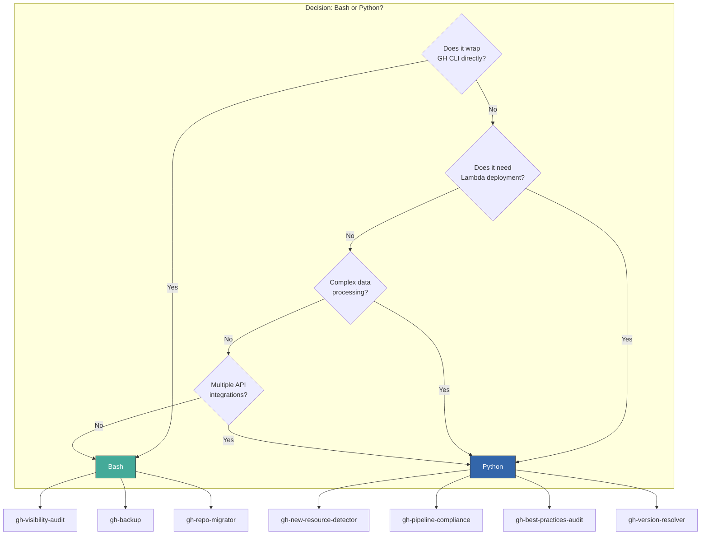

| Tool | Language | Rationale |
|------|----------|-----------|
| gh-visibility-audit | Bash | Simple GH CLI wrapper. List repos, read/write visibility. `gh api` does the heavy lifting. |
| gh-backup | Bash | Primarily `git clone` and `gh api` calls. File system operations are natural in bash. |
| gh-repo-migrator | Bash | Simple API calls to transfer repos. CSV parsing is manageable in bash. |
| gh-new-resource-detector | Python | Lambda deployment needed. Date/time comparison logic. Pagination handling. |
| gh-pipeline-compliance | Python | Lambda deployment. YAML parsing of workflow files. Pattern matching. Scoring logic. |
| gh-best-practices-audit | Python | Most complex tool. Multiple benchmark frameworks. Excel parsing. Scoring engine. Lambda. |
| gh-version-resolver | Python | Lambda deployment. Complex version comparison. Semantic versioning. Multiple registries. |

---

## 8. Remote Execution Pattern

The user emphasized: "always allow the user to run this script remotely via curl or GH and not have to clone this."

### Bash Tools (curl-based)

```bash
# Direct execution
curl -sL https://raw.githubusercontent.com/h3nryza/gh_scripts/main/tools/gh-visibility-audit/gh-visibility-audit.sh | bash -s -- --org my-org

# Or via gh
gh repo view h3nryza/gh_scripts --json url -q '.url' | xargs -I {} curl -sL {}/raw/main/tools/gh-visibility-audit/gh-visibility-audit.sh | bash -s -- --org my-org
```

### Python Tools (fetch and run)

```bash
# Fetch, setup venv, run, teardown
curl -sL https://raw.githubusercontent.com/h3nryza/gh_scripts/main/tools/gh-new-resource-detector/setup_venv.sh | bash
curl -sL https://raw.githubusercontent.com/h3nryza/gh_scripts/main/tools/gh-new-resource-detector/main.py -o /tmp/gh-nrd/main.py
# ... fetch lib/ files ...
/tmp/gh-nrd/venv/bin/python /tmp/gh-nrd/main.py --enterprise my-ent
```

For Python tools, we will provide a `run_remote.sh` wrapper that handles the fetch-setup-run-teardown cycle in one command.

---

## 9. Lambda vs Local Decision Matrix

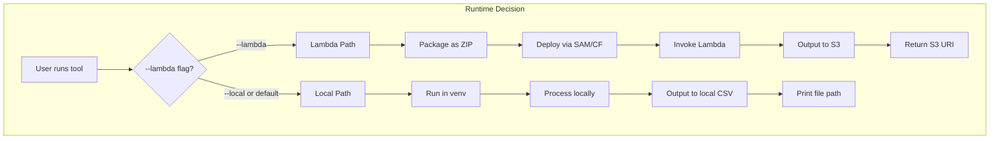

| Aspect | Local | Lambda |
|--------|-------|--------|
| Auth | Any (GH CLI, PAT, App) | App or PAT only (no GH CLI) |
| Output | Local CSV file | S3 bucket |
| Scheduling | cron / manual | EventBridge rule |
| Timeout | None | 15 min max |
| Cost | Free | Pay per invocation |
| Best for | Ad-hoc, development | Scheduled monitoring |

---

## 10. CSV Output Standard

All tools produce CSV with a standard header pattern:

```
timestamp,enterprise,org,user,repo,<tool-specific-columns>
```

- **Timestamp**: ISO 8601 format (`2026-05-10T14:30:00Z`)
- **File naming**: `YYYYMMDD_HHMMSS_<tool_name>.csv`
- **Location**: Current working directory (unless `--output-dir` specified)
- **Encoding**: UTF-8
- **Delimiter**: Comma (no tabs, no pipes)

This ensures any tool's output can be used as another tool's input.

---

## 11. CLI Interface Standard

Every tool supports this minimum interface:

```
tool-name [options]

Options:
  -h, --help              Show this help message with examples
  -i, --interactive       Interactive mode (guided questions)
  -v, --verbose           Verbose output
  -q, --quiet             Suppress non-essential output
  --version               Show version
  --auth TYPE             Auth method: gh-cli|pat|app (default: auto-detect)
  --token TOKEN           PAT token (or set GITHUB_TOKEN env var)
  --app-id ID             GitHub App ID
  --app-key FILE          GitHub App private key file
  --output-dir DIR        Output directory (default: current directory)
  --output-format FORMAT  Output format: csv|json (default: csv)
  --enterprise NAME       Target enterprise
  --org NAME              Target organization
  --user NAME             Target user
  --import FILE           Import CSV for batch operations
  --export FILE           Export results to specific file
```

### Interactive Mode Flow

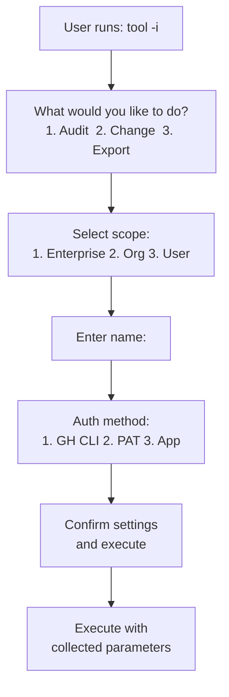

---

## 12. Testing Strategy

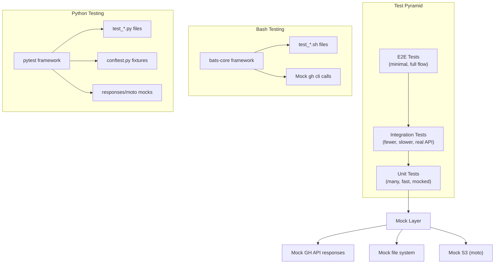

- **Bash tests**: Use [bats-core](https://github.com/bats-core/bats-core). Mock `gh` and `curl` commands with function overrides.
- **Python tests**: Use pytest with `responses` library for HTTP mocking and `moto` for AWS mocking.
- **TDD**: Write tests first. Golden Rule #11.
- **Coverage target**: 80%+ for core logic. Auth and help modules get basic smoke tests.

---

## 13. Key Risks and Mitigations

| Risk | Impact | Mitigation |
|------|--------|------------|
| GitHub API rate limiting | 5000 req/hr for PAT, 15000 for App | Implement exponential backoff; use conditional requests; cache responses |
| Enterprise API requires special permissions | Scripts 1,4,6 may fail | Document required scopes; fail gracefully with clear error messages |
| Large orgs with 1000+ repos | Timeouts, memory issues | Pagination with streaming; process in batches; progress indicators |
| Lambda cold starts | Slow first invocation | Use provisioned concurrency for critical tools; keep packages small |
| CSV injection | Security vulnerability | Sanitize cell values; prefix with single quote for formulas |
| Token leakage in logs | Security breach | Never log tokens; mask in verbose output; use env vars |

---

*This document is maintained by the Architect Agent. Updates are logged in changelog.md.*
*Written by h3nryza*
